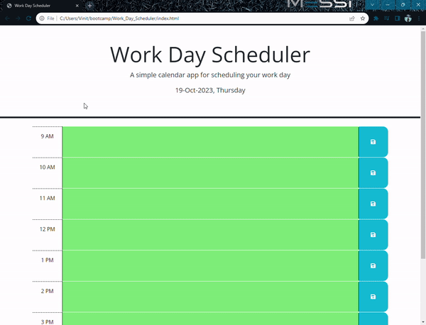

# Work Day Scheduler

## Description

I have created this small website called "Work Day Scheduler". It displays current date and day and
let the user enter to-do task per hour. 

## Installation

<a href ="https://vinitp2.github.io/Work_Day_Scheduler/" target="_blank"> Click Me to access the website ! </a>

## Usage

This website opens on a main page where there is the heading of the website and on the header, current day and date is displayed.

On the main section, there are hourly time blocks from 9 AM to 5 PM. They are color coded. So grey means that hour has been passed, orange means it is current hour and Green means the upcoming hours.

Each time block has a text area and save button next to it. So the user can type their tasks for the corresponding hours and press the save button next to it to save their notes.

The website uses user's local storage of their browser to store and fetch the notes they have saved.

<h3>The following is a quick demo of the software</h3>

## License
N/A
